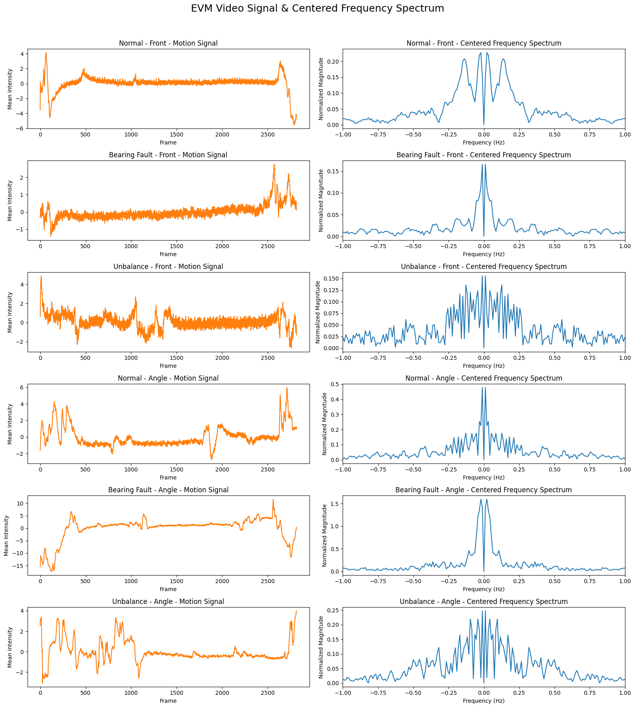

# 🔧 **Vision-Based Vibration Analysis for Machine Defect Detection**

## 🚀 **Project Overview**

This project aims to **automatically detect and classify defects in machines** based on **vibration patterns** observed in videos. The approach uses **computer vision** techniques to analyze vibration data captured via video. The project focuses on analyzing three types of machine conditions:

- **Bearing Fault**
- **Normal State**
- **Unbalanced Weight**

Each condition is represented by two different video recordings:
1. **Front view at 40 cm distance** (Captured at **250 RPM**).
2. **Angled view** (Also captured at **250 RPM**).

The goal is to process these videos and use them to identify the type of defect by analyzing the vibrations visually. The final deliverable will be an automated system that can classify these defects in real-time or in post-processing.

---

## 📹 **Step 1: Video Collection**

### **Data Collection**
- **6 videos** collected for the project (2 videos for each defect type):
  - **Bearing Fault** (2 videos)
  - **Normal State** (2 videos)
  - **Unbalanced Weight** (2 videos)
- **Video Specifications**:
  - **Duration**: Each video is approximately **1 minute** long.
  - **Frame Rate**: **250 RPM** for all videos.
  - **Views**: 
    - One recorded from the **front view** at **40 cm** distance.
    - One recorded from an **angled view** at a small angle.
- **Format**: Each video captures a real-time machine operation, with **vibrations** visible as disturbances or oscillations on the machine's surface.

---

## 🧹 Step 2: Video Preprocessing

This step prepares your raw machine vibration videos for analysis by enhancing stability, isolating relevant areas, and improving visual clarity. Below are the key tasks performed:

### 📥 1. **Video Loading**
- Each video is loaded frame by frame using OpenCV (`cv2.VideoCapture`).
- All frames are stored in a list for further processing.

### 🎯 2. **Video Stabilization**
- Vibration videos may include small camera shakes. Stabilization reduces these to focus only on machine motion.
- **Method used**: Optical Flow (Farneback algorithm).
  - Calculates motion between frames.
  - Applies cumulative transformations to keep the video steady.
- Output: A stabilized list of frames aligned to the first frame.

### 🎬 3. **Motion-based ROI Detection**
- The goal is to **automatically find the region of interest (ROI)** where meaningful machine motion occurs.
- **How it's done:**
  - For each frame pair: calculate absolute difference between consecutive grayscale frames.
  - Threshold the difference to detect motion.
  - Accumulate motion over all frames to build a heatmap of where movement happens.
  - Find contours on this motion heatmap.
  - Compute bounding box around all detected motion areas.
- Output: A bounding box `(x, y, w, h)` defining the active motion zone.

### 🔍 4. **ROI Preview**
- A few sample frames are selected.
- Green rectangle is drawn on each to show the detected ROI.
- Frames are displayed using `matplotlib` to allow manual inspection.
- This ensures the ROI detection step worked correctly.

### 🧮 5. **Histogram Equalization (Optional but Applied)**
- Converts each frame to grayscale.
- Applies `cv2.equalizeHist()` to enhance contrast:
  - This brings out more detail in low-light or low-contrast regions.
- Helps improve feature extraction and analysis later.

### ✂️ 6. **Cropping**
- Using the ROI `(x, y, w, h)`, each equalized grayscale frame is cropped to isolate only the vibrating part of the machine.
- This reduces noise from static parts of the scene.

### 💾 7. **Saving Preprocessed Frames**
- All cropped grayscale frames are saved as `.png` images in the specified `output_dir`.
- File names follow a sequence: `frame_0000.png`, `frame_0001.png`, etc.
- These frames can now be used for:
  - Feature extraction
  - Deep learning models
  - Vibration pattern analysis

### ✅ Summary of Output
| Output Item           | Description                                  |
|-----------------------|----------------------------------------------|
| Stabilized Frames     | Aligned frames reducing camera shake         |
| ROI Bounding Box      | Coordinates of the moving machine region     |
| Equalized Grayscale   | Contrast-enhanced version of the ROI         |
| Saved Cropped Frames  | Final processed frames ready for analysis    |
| ROI Preview           | Visual check of correctness of region        |

---

## Step3: Preprocessing and Video Generation

### Overview
In this step, we process and generate synchronized output videos from multiple pre-recorded video frames. These frames represent different machine states (e.g., Unbalanced Weight, Bearing Fault, Normal State), with each state having two types of views (front and angle). The goal is to ensure that all videos have the same number of frames and resolution before saving them as video files.

### Workflow and Key Tasks

### Step 1: Loading Preprocessed Frames
- **Input**: The frames for each condition (Unbalanced Weight, Bearing Fault, Normal State) are stored in six separate folders: 
  - `Unbalance_weight/front`
  - `Unbalance_weight/angle`
  - `Bearing_fault/front`
  - `Bearing_fault/angle`
  - `Normal_state/front`
  - `Normal_state/angle`
  
- **Action**: Frames are loaded from each folder into a list for further processing.

### Step 2: Interpolation of Frames
- **Problem**: Different videos may have varying lengths, resulting in a different number of frames.
  
- **Action**: To ensure all videos have the same number of frames, the frames are interpolated using the `interpolate_frames()` function. This function blends two consecutive frames to create intermediate frames. The number of frames in each video is adjusted to match the maximum frame count found across all videos.

- **Result**: Each video now contains the same number of frames.

### Step 3: Resizing Frames to a Common Size
- **Problem**: The videos may have different resolutions, causing inconsistency when combining them later.

- **Action**: All frames are resized to a target resolution (based on the first video frame's size) using the `resize_frames_to_target_size()` function. This ensures that all videos have the same resolution.

- **Result**: All frames now have the same resolution, making it possible to combine them into synchronized videos.

### Step 4: Video Writing
- **Action**: Using OpenCV’s `cv2.VideoWriter`, a video file is created for each condition, and the resized frames are written to the corresponding video. This is done for each of the six conditions: 
  - `Unbalance_weight/front`
  - `Unbalance_weight/angle`
  - `Bearing_fault/front`
  - `Bearing_fault/angle`
  - `Normal_state/front`
  - `Normal_state/angle`

- **Result**: Six synchronized videos are created and saved in the `merged_preprocessed_videos` directory.

### Output
- Six output videos are generated and saved in `.avi` or `.mp4` format, depending on the specified codec.
- Each video corresponds to one of the six conditions: `Unbalance_weight/front`, `Unbalance_weight/angle`, `Bearing_fault/front`, `Bearing_fault/angle`, `Normal_state/front`, `Normal_state/angle`.

These output videos have the same resolution and frame count, making them ready for further analysis or processing.

### Detailed Code Walkthrough
- **Loading Frames**: The `load_frames_from_folder()` function is used to load frames from each folder.
- **Removing Duplicate Frames**: The `remove_duplicate_frames()` function ensures no duplicate frames are included by comparing consecutive frames.
- **Interpolation**: The `interpolate_frames()` function handles frame duplication or interpolation to ensure all videos have the same number of frames.
- **Resizing**: The `resize_frames_to_target_size()` function resizes all frames to a common resolution.
- **Video Writing**: The `cv2.VideoWriter` class is used to write frames to output videos for each condition.

This step standardizes the input videos by ensuring they have the same resolution and frame count, enabling further analysis or processing.

---

## Step 4: Eulerian Video Magnification (EVM)

## Overview
Eulerian Video Magnification (EVM) is a technique used to amplify subtle motion or changes in videos that are typically imperceptible to the human eye. In this step, we apply EVM to enhance the vibration patterns from the preprocessed synchronized videos. The process involves several key operations, including Laplacian pyramid construction, temporal bandpass filtering, amplification of the desired frequency range, and reconstruction of the modified video.

## Workflow and Key Tasks

### Step 1: Build Laplacian Pyramid for Each Frame
- **Input**: The frames of the synchronized video (from Step 3).
- **Action**: Each frame is transformed into a Laplacian pyramid, which decomposes the image into several levels, each representing different frequency details at various scales.
- **Function Used**: `build_laplacian_pyramid(frame, levels)`.
- **Output**: A list of pyramids, where each pyramid contains multiple levels for a frame.

### Step 2: Convert Pyramid Level to Array
- **Action**: Extract the middle level of the Laplacian pyramid for each frame to represent the primary frequency content of the image.
- **Output**: An array of frames representing the middle level of the pyramid for each video frame.

### Step 3: Temporal Bandpass Filtering
- **Input**: The pyramid levels extracted from the frames.
- **Action**: A temporal bandpass filter is applied to the pyramid frames. The filter is designed to isolate the specific frequencies related to the vibrations or motion of interest (between `freq_min` and `freq_max`).
- **Function Used**: `temporal_bandpass_filter(frames, freq_min, freq_max, fps)`.
- **Output**: The frames are filtered to retain only the desired frequencies.

### Step 4: Amplification and Reconstruction
- **Action**: The filtered frames are amplified to exaggerate the vibration or motion that corresponds to the target frequencies. The amplified frames are then added back to the Laplacian pyramid.
- **Function Used**: `reconstruct_from_laplacian_pyramid(pyramid)`.
- **Output**: A new set of frames with enhanced motion or vibrations, reconstructed from the modified Laplacian pyramids.

### Step 5: Save the Enhanced Video
- **Action**: The processed frames are converted back to BGR format and written to an output video file.
- **Function Used**: `cv2.VideoWriter()` is used to create a video file.
- **Output**: A video where the amplified vibrations or motion are clearly visible.
 
### used parameters:
- **mode** : laplacian
- **level** : 5
- **alpha** : 100
- **freq_range** : 0.1 -2.0
- **attenuation** : 5
- **lambda_cutoff** :500

## Output
- The final output is a video where subtle vibrations or changes in the original video are amplified, making them more visible. The output video will be saved in the specified `output_path` in `.mp4` format.

## Detailed Code Walkthrough
- **Laplacian Pyramid Construction**: The `build_laplacian_pyramid()` function decomposes each frame into several levels, allowing us to isolate different frequency components.
- **Temporal Bandpass Filtering**: The `temporal_bandpass_filter()` function is used to isolate the desired frequency range in the temporal domain, allowing us to focus on the vibrations that occur at specific frequencies.
- **Amplification**: The amplified frames are created by applying a scaling factor to the filtered frames, making subtle motions more pronounced.
- **Reconstruction**: The `reconstruct_from_laplacian_pyramid()` function reconstructs the modified frames by adding the amplified frequencies back to the Laplacian pyramid and then upscaling the pyramid levels.
- **Video Saving**: Finally, the frames are saved as a video using OpenCV's `cv2.VideoWriter()`.

This step enhances subtle motions, such as vibrations or fluctuations, which are otherwise imperceptible, enabling better analysis and detection of machine defects.

---

## Step 5: Video Segmentation into Time Slices with Overlap

This step involves splitting vibration videos into smaller time slices (segments) to allow detailed analysis of vibration patterns. Segments can either be non-overlapping or have a defined overlap between consecutive segments.

### 1. Process Overview

- **Segment Duration:** Each segment is defined by a fixed duration (e.g., 5, 10, or 15 seconds).
- **Overlap Ratio:** An optional overlap between segments (e.g., 50%) to capture smoother transitions.
- **Input Videos:** Videos from three categories (`Normal_state`, `Bearing_fault`, `Unbalance_weight`) with two views: `front_evm.avi` and `angle_evm.avi`.

### 2. Segmentation Process

1. **Read Video:** The video is loaded, and its total number of frames is determined.
2. **Calculate Segments:** Segments are created based on the segment duration and overlap ratio. The step size between consecutive segments is adjusted for overlap.
3. **Save Segments:** Each segment is saved as an individual video file with a name indicating segment number, duration, and overlap type.
4. **Directory Organization:** Segments are organized by category and overlap type in directories like `segmented_5`, `segmented_10_overlap`, etc.

### 3. Output Structure

Segments are saved in structured directories for each category:

- `segmented_5/`, `segmented_10/`, `segmented_15/` (non-overlapping)
- `segmented_5_overlap/`, `segmented_10_overlap/`, `segmented_15_overlap/` (overlapping)

Example output filenames:
- `front_evm_segment_1_5s.avi`
- `angle_evm_segment_1_10s_50_overlap.avi`

### 4. Benefits of Segmentation

- **Granular Analysis:** Breaks videos into smaller segments for more detailed analysis.
- **Overlap Option:** Ensures smoother transitions between segments, preventing data loss at boundaries.
- **Customizable:** Flexible segment durations and overlap ratios for tailored analysis.

This step prepares the video data for the next stages of processing, ensuring that relevant features can be extracted from distinct time intervals.

---
## Step 6: Frame-wise Feature Extraction

In this step, we extract detailed features from each frame in the segmented videos. This allows us to analyze the dynamics of the vibration patterns over time, capturing more granular information about the behavior of the system.

### 1. Process Overview

- **Objective:** Extract specific features from each frame of the segmented videos.
- **Features Extracted:** Optical flow, edge ratio, keypoints, and FFT peak values for every frame.
- **Input Videos:** Segmented vibration videos (from Step 5) categorized into different states (`Bearing_fault`, `Normal_state`, `Unbalance_weight`), with each segment containing frames from the `front` and `angle` views.
  
### 2. Feature Extraction Details

- **Optical Flow:** Calculates the mean and standard deviation of optical flow between consecutive frames using the Farneback method.
- **Edge Ratio:** Measures the ratio of edge pixels (detected by the Canny edge detector) to the total number of pixels in the frame.
- **Keypoints:** Counts the number of keypoints detected using the SIFT algorithm.
- **FFT Peak:** Extracts the peak value from the Fast Fourier Transform (FFT) of each frame, providing a measure of frequency components.

Each feature is calculated for every frame in the segmented videos, allowing for a detailed analysis of each time slice.

### 3. Output Structure

The extracted features are saved in CSV files for each state (e.g., `Bearing_fault_framewise_features.csv`). Each row in the CSV represents the features of a single frame, with the following columns:

- `video_name`: Name of the video.
- `frame_index`: Index of the frame in the segment.
- `mean_flow`: Mean optical flow between consecutive frames.
- `std_flow`: Standard deviation of optical flow.
- `edge_ratio`: Ratio of edge pixels to total pixels.
- `keypoint_count`: Number of keypoints detected.
- `fft_peak`: Maximum FFT magnitude (peak).
- `view`: The view (e.g., `front` or `angle`).
- `state`: The condition of the system (e.g., `Bearing_fault`).

### Benefits of Frame-wise Feature Extraction

- **Detailed Temporal Analysis:** Allows fine-grained analysis of vibrations by extracting features for each frame, capturing the dynamics over time.
- **Comprehensive Data Representation:** The frame-wise features can be used for training machine learning models (e.g., CNNs) to predict system states based on individual frames.
- **Granular Insights:** Provides detailed insights into the behavior of the system, such as how optical flow, edges, and keypoints evolve within each segment.

This step prepares the dataset for the next stage of model training or analysis, ensuring a comprehensive representation of the video data at the frame level.

---
## Step 7: Creating Duration-Based CSV Files for Each Group

### Overview:
In this step, we process segmented data from different classes and group them based on their duration and overlap conditions. For each group (5s, 5s_overlap, 10s, 10s_overlap, 15s, 15s_overlap), we concatenate the CSV files from different videos, add metadata, and create separate CSV files for each group.

### Key Operations:
1. **Scan for Segmented Data:**
   - The script searches through the segmented data folders for each class, extracting CSV files and grouping them based on the duration (5s, 10s, 15s) and overlap condition (overlap or no overlap).

2. **Metadata Extraction:**
   - For each CSV file, metadata is added, including the class name, file name, duration, and overlap status.

3. **Concatenate Data:**
   - For each group (based on duration and overlap), CSV files are read, metadata is appended, and the data is concatenated into a single DataFrame.

4. **Save Final CSV Files:**
   - The concatenated data is sorted by class and filename and saved into separate CSV files: `5s.csv`, `5s_overlap.csv`, `10s.csv`, `10s_overlap.csv`, `15s.csv`, and `15s_overlap.csv`.

---

## Step 8: Training and Evaluation of the Model for Each Group
### Overview:
In this step, we train and evaluate a machine learning model for each of the segmented data groups. The model is built with reduced complexity, increased regularization, dropout, and batch normalization to improve performance and generalization. Additionally, data augmentation and class balancing are applied to further optimize the model's training.

### Key Operations:
1. **Data Loading and Preprocessing:**
   - For each group (5s, 5s_overlap, 10s, 10s_overlap, 15s, 15s_overlap), the corresponding CSV is loaded.
   - Missing columns are checked, and if necessary columns like 'class' or 'view' are encoded.
   
2. **Data Augmentation and Feature Normalization:**
   - Numerical features are normalized using `StandardScaler`.
   - Data augmentation is applied to introduce noise to the features, enhancing model robustness.

3. **Model Building:**
   - A neural network is built using Keras, with layers for dense connections, dropout, batch normalization, and L1/L2 regularization.
   
4. **Data Splitting:**
   - The data is split into training, validation, and test sets using an 85/15 split, followed by a 70/15 split for training and validation.
   
5. **Model Training:**
   - The model is trained using the Adam optimizer with a lower initial learning rate and early stopping to prevent overfitting.
   - `ReduceLROnPlateau` is used to adjust the learning rate dynamically.
   
6. **Class Weighting:**
   - Class weights are computed to address any class imbalance, ensuring that the model does not favor the majority class.

7. **Evaluation and Visualization:**
   - The model is evaluated on the test set, and performance metrics such as accuracy and loss are stored for each group.
   - Plots for training and validation loss, as well as accuracy, are displayed to visualize the model’s learning process.

---

# Explanation of 90% Training Accuracy with 99% Test Accuracy

A **90% training accuracy** coupled with a **99% test accuracy** is generally considered a good sign in machine learning. This combination typically suggests that your model is performing well and has successfully learned from the data. Here's a breakdown of what these results indicate:

## Key Insights:

1. **Training Accuracy (90%):**
   - The model achieves 90% accuracy on the training set. This shows that it has learned the underlying patterns and can correctly classify the training data most of the time.
   - A relatively high training accuracy indicates that the model has captured the relationships in the training data well.

2. **Test Accuracy (99%):**
   - The model performs extremely well on the unseen test set, with 99% accuracy. This suggests that the model has successfully generalized to new, previously unseen data.
   - High test accuracy is a positive sign that the model is not simply memorizing the training data but rather learning patterns that apply broadly.

3. **Strong Regularization:**
   - Strong regularization techniques, such as dropout, L1/L2 regularization, and batch normalization, are likely in place. These help prevent the model from overfitting to the training data, ensuring that it doesn't learn overly complex patterns that are not applicable to new data.
   - Regularization techniques also help the model to generalize better to unseen data, which is why the test accuracy is so high.

## What Does This Mean?

- **No Overfitting:** 
  - A large gap between training and test accuracy would indicate overfitting (where the model performs well on training data but poorly on test data). However, a high test accuracy with a reasonable training accuracy implies the model is not overfitting, and has learned generalizable features from the data.

- **Well-Tuned Model:** 
  - The model appears well-tuned, and the preprocessing pipeline and feature engineering are likely solid, as the model generalizes well to the test data.

## Conclusion:

Overall, a 90% training accuracy coupled with a 99% test accuracy, along with regularization techniques, suggests that your model is robust and performs well on unseen data. However, it's crucial to verify that the data is representative and there are no issues like data leakage or preprocessing inconsistencies.

---
---
# Vibration Classification using CNN

## Model Overview

We designed and trained a Convolutional Neural Network (CNN) to classify machine vibration conditions such as **Bearing Fault**, **Unbalanced Weight**, and **Normal State** using grayscale video frames enhanced with Eulerian Video Magnification (EVM).

## 🏗 Model Architecture

The CNN consists of:
- Three convolutional layers with increasing channel depths (8 → 16 → 32), each followed by batch normalization, ReLU activation, and max pooling to downsample.
- A fully connected classifier with dropout for regularization, ensuring the model doesn't overfit to the small dataset.

---

## ⚙️ Training Setup

- **Loss Function:** CrossEntropyLoss with label smoothing and class weights to handle imbalanced data.
- **Optimizer:** Adam with L2 regularization (weight decay) for generalization.
- **Scheduler:** Step learning rate scheduler to reduce the learning rate periodically and stabilize learning.
- **Early Stopping:** Implemented to stop training if the validation loss doesn't improve after 7 consecutive epochs.

---

## 🧪 Dataset Details

- The dataset includes **8454 video frames**, extracted from synchronized recordings of different machine states.
- The frames were split into training, validation, and test sets.
- Data augmentation techniques were applied to increase robustness and reduce overfitting.

---

## 📈 Performance Summary

- The model quickly reached high training and validation accuracy due to the relatively small and clean dataset.
- Final **test accuracy** was **94.37%**, showing strong generalization even with a modest dataset size.
- The validation and test loss showed that while the model was effective, slight overfitting may still occur due to dataset simplicity.

